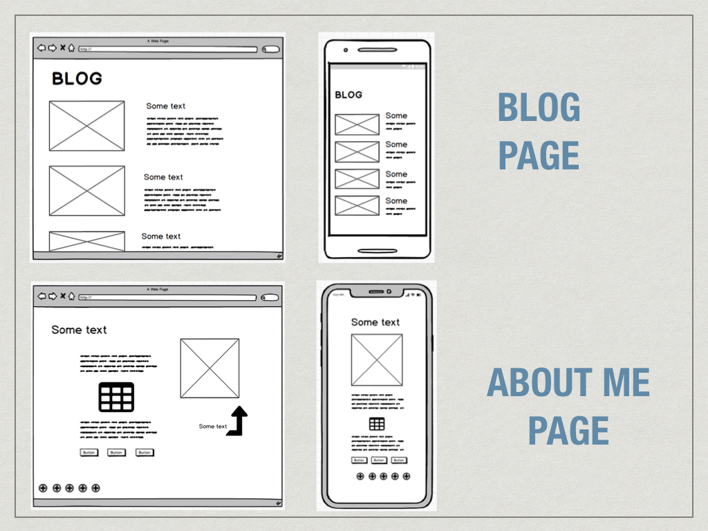

######Student#: CAS021901 
######Name: Cassie Sloan
######Assignment 2: Website Portfolio
[Github](https://github.com/CassieSloan/Portfolio)
[Live Site](https://condescending-noyce-61fcf7.netlify.com/
)

### Purpose
The purpose of this website build is to showcase my skills, personality and body of work to potential employers, co-workers and collaborators.

###Functionality / features
- Animated buttons and images
- Embeded social media feeds
- Responsive design
- Easy-to-read format

###Sitemap

###Screenshots

###Target audience
- Potential Employers
- Co-workers
- Students
- Collaborators
###Tech stack 
- HTML
- CSS
- SASS
- Markdown (readme)
- Github (source control)
- Netlify (launch platform)
- Sha384 (encryption for subresource integrity)

###Slide Deck

